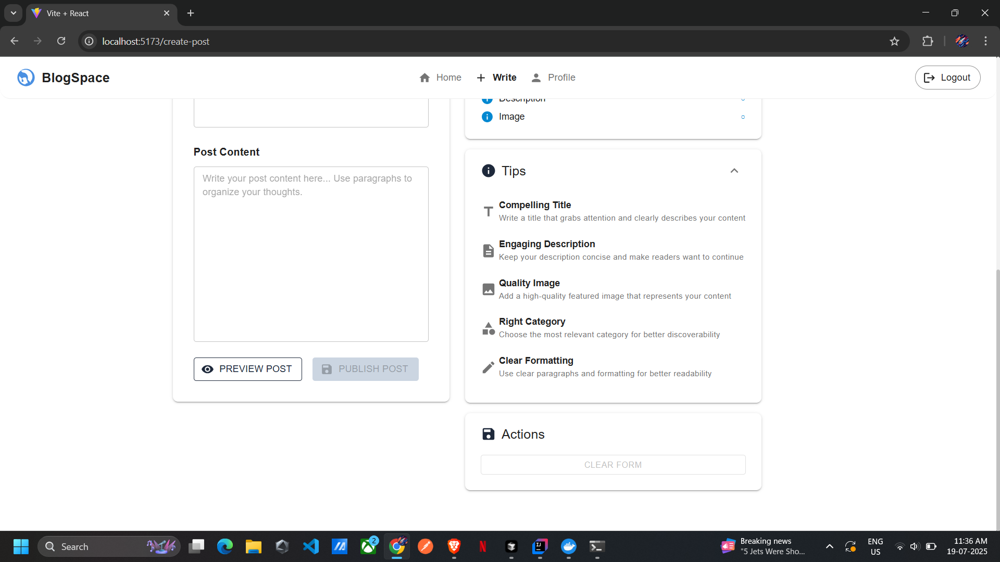

# BlogSpace

**A modern educational blog platform built for sharing knowledge, connecting with readers, and building learning communities**

**Tech Stack:** Vite + React | Springboot | Modern UI/UX | Responsive Design

---

## Key Features

**Discover what makes BlogSpace the perfect platform for educational content sharing**

### 🏠 Content Discovery
Browse educational posts with category filtering, featured content, and engaging previews with author information and metrics.

### ✍️ Rich Content Creation
Comprehensive post editor with real-time statistics, draft management, and featured image support for professional publishing.

### 👤 User Profiles
Personal profiles showcasing post history, liked content, and user statistics with secure authentication system.

### 💬 Community Engagement
Interactive comment system, like functionality, and user engagement tracking to build vibrant learning communities.

### 📚 Educational Focus
Specialized for technical tutorials with code syntax highlighting, programming guides, and educational best practices.

### 📱 Modern Design
Clean, responsive interface optimized for all devices with intuitive navigation and distraction-free reading experience.

---

## Project Statistics

| Feature | Count |
|---------|-------|
| **Main Features** | 3+ |
| **Content Categories** | 2 |
| **Responsive** | 100% |
| **Tech Stack** | Modern |

---

## Project Screenshots

**Take a visual tour through the BlogSpace application interface**

### 🏠 Homepage - Content Discovery

Clean homepage layout featuring educational blog posts with category filtering (All, Education, Sports), post previews, and engaging thumbnails. The interface showcases a modern design with easy navigation and content discovery.

### 📝 Posts Grid - Enhanced View  

Improved post display with author information, engagement metrics (likes and comments), and better visual hierarchy for content discovery. Each post card displays essential information at a glance.

### ✏️ Content Creation - Rich Editor

Comprehensive post creation interface with real-time statistics (word count, reading time), category selection, featured image support, and draft management. The editor provides a professional writing experience.

Advanced preview functionality allowing users to see how their post will appear before publishing, with real-time formatting and layout preview.

### 👤 User Profile - Personal Dashboard

User profile showcasing personal statistics (3 total posts, 2 liked posts), avatar, and user-specific content management with "My Posts" and "Liked Posts" tabs for personalized content organization.

### 📖 Article View - Reading Experience

Distraction-free article reading interface with clean typography, syntax highlighting for code blocks, and integrated comment system for enhanced learning experience.

### 💬 Community Engagement - Comments

Interactive comment system allowing users to engage with content creators and other readers, fostering community discussion and knowledge sharing.

### 🔐 Authentication - Secure Access

Secure user authentication system with login functionality, featuring clean design and user-friendly interface for seamless access to the platform.

User registration system with comprehensive signup form, ensuring secure account creation and onboarding for new users.

---

## Features Overview

### Core Functionality
- **Content Management**: Create, edit, and publish educational blog posts
- **User System**: Secure authentication and personalized user profiles  
- **Engagement**: Like posts, comment system, and community interaction
- **Discovery**: Category-based filtering and content browsing
- **Statistics**: Real-time post metrics and user analytics

### Technical Highlights
- **Frontend**: Built with Vite + React for fast, modern user experience
- **Backend**: Node.js server with robust API architecture
- **Design**: Responsive UI/UX optimized for all device sizes
- **Performance**: Optimized loading and smooth user interactions

### Educational Focus
BlogSpace is specifically designed for educational content sharing, featuring:
- Code syntax highlighting for programming tutorials
- Clean reading experience for technical documentation
- Community-driven learning through comments and likes
- Organized content discovery through smart categorization

---

## Getting Started

This platform provides an intuitive interface for both content creators and readers, making it easy to share knowledge and build learning communities in the educational technology space.